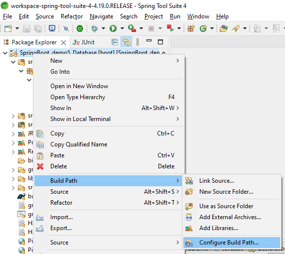

### Spring Boot Demo 5 Database Example (H2 Database)

**Steps:**
<ol>
<li>To setup IDE for Spring project, follow steps in https://github.com/worldpeacez0991/SpringBoot_demo1</li>

 

<li>Add External Jar to Classpath for H2 driver
<ul>
<li>Via Spring IDE, right click on 'Referenced Libraries' > Bulid Path > Configure Build Path...</li>
<kbd></kbd>  
<li>Via Properties window, select 'classpath' and add external jar 'lib\h2-2.2.220.jar'</li>
<kbd></kbd> 
</ul>
</li>

 

<li>Edit file 'application.properties' 
 (My %USERNAME% is USER1, you may edit this folder path to any folder where you have enough permissions )
 ***Note that this folder path will have to match with the steps for 'http://localhost:8080/h2-console' later.

spring.datasource.url=jdbc:h2:file:C:\\Users\\USER1\\H2_DB

</li>

 

<li>Start Spring Boot App
<ul>
<li>Via Spring IDE, open 'DemoApplication.java', press 'Alt+Shift+X, B', to start 'Spring Boot App'</li>
<li>Via browser, type 'http://localhost:8080/h2-console', to test</li>
<kbd></kbd> 
<kbd></kbd> 

 

<li>When Spring Boot Application starts, SQL Data is loaded with this file 'src\main\resources\data.sql'
 In H2 console, you will see that 'COUNTRIES' is loaded with SQL Data.
</li> 
<kbd></kbd> 
</ul>
</li>
</ol>

Credits: https://spring.io/team 
Source: https://www.baeldung.com/spring-boot-h2-database 

